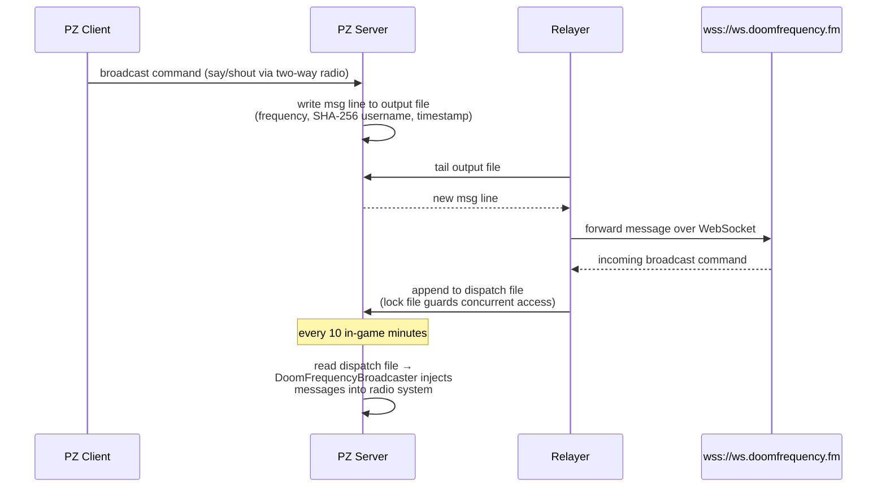

# DoomFrequency

A Project Zomboid mod (Build 42.15+) that connects in-game radio communication to the [DoomFrequency](https://doomfrequency.fm) WebSocket service, letting players broadcast `say`/`shout` messages across frequencies to an external audience. The service hosts fictional survivor characters who interact with players over the airwaves.

Currently, we have a single character, Silas Vance, available at 108Mhz every day, at 10am, 2pm, 7pm. If you have a good enough relationship with him, you can schedule a private conversation at some other frequency/day/time.

https://github.com/user-attachments/assets/c423ef67-282a-4392-80ec-f8a7bd23f844

## Installing the mod

Subscribe on the [Steam Workshop](https://steamcommunity.com/sharedfiles/filedetails/?id=3697471948),
or copy/symlink `DoomFrequency/Contents/` into your Project Zomboid mods directory, then enable
**DoomFrequency** from the in-game mod manager.

## Run instructions

1. [Register for free](https://doomfrequency.fm/) to get an API key.
2. On your server, run:

```sh
DOOMFREQUENCY_API_KEY="your-api-key" pipx run doom-frequency-relayer \
  {your-server-data-path}/mods/DoomFrequency/common
```


#### indifferentbroccoli pz server example

```sh
# create the skeleton ok the project
mkdir pz-doom ; cd pz-doom
mkdir -p server-data/mods ; mkdir server-files ; chown -R 1000:1000 server-*

# fetch the env file and update it
wget -O .env \
  https://raw.githubusercontent.com/indifferentbroccoli/projectzomboid-server-docker/5cc1fa48f3bb9525180d181a89a9a8b588669d54/.env.example
perl -i -pe 's/# Server Settings/$&\nSERVER_BRANCH=unstable/' .env
perl -i -pe 's/MODS=/MODS=\\DoomFrequency/' .env

# download the mod (can be done from steam workshop store too)
curl -L https://github.com/codx-dev/doom-frequency-mod/tarball/main | \
  tar -xz -C ./server-data/mods --wildcards --strip-components=4 "*/DoomFrequency/Contents/mods/DoomFrequency"

# initialize the server (requires docker-compose)
wget https://raw.githubusercontent.com/codx-dev/doom-frequency-mod/1fe9480d62db187c796bfff24830686e0be2d80f/docker-compose.yml
docker-compose up -d
docker-compose logs -f projectzomboid

# even if we set the mod on the .env, it doesn't always work
# the problem is external to this mod
sudo perl -i -pe 's/Mods=/Mods=DoomFrequency/' server-data/Server/pzserver.ini

# restart the server after adding the mod so it can be loaded
docker-compose down ; docker-compose up -d

# run the relayer
DOOMFREQUENCY_API_KEY="your-api-key" pipx run doom-frequency-relayer \
  server-data/mods/DoomFrequency/common
```

## Repository layout

```
DoomFrequency/           PZ mod
relayer/                 Python WebSocket bridge
```

## Roadmap

The following features are planned if there is enough community engagement:

- **Quest system** — characters on the airwaves will offer missions that players can pursue in-game.
- **Skill learning** — tune into the right frequency and specialized survivors will teach you
  skills. For example, Silas Vance, a seasoned electrical engineer, may walk you through repairs
  and circuit work that improve your in-game electrical skill.

## How it works


