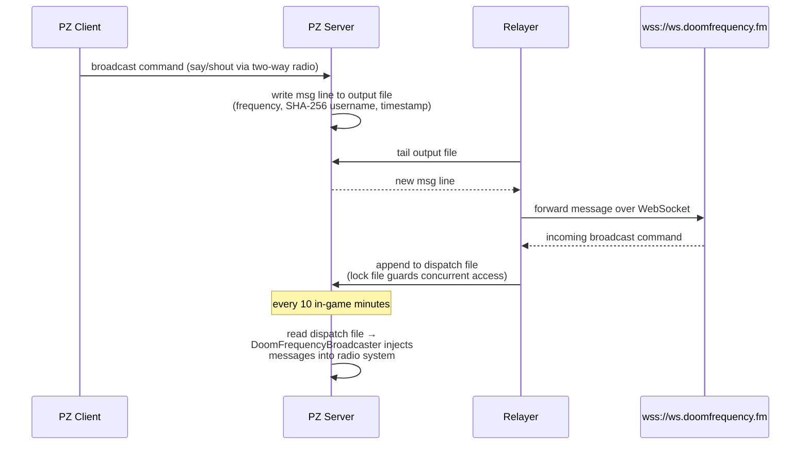

# DoomFrequency

A Project Zomboid mod (Build 42.15+) that connects in-game radio communication to the
[DoomFrequency](https://doomfrequency.fm) WebSocket service, letting players broadcast
`say`/`shout` messages across frequencies to an external audience. The service hosts
fictional survivor characters who interact with players over the airwaves.

## Installing the mod

Subscribe on the [Steam Workshop](https://steamcommunity.com/sharedfiles/filedetails/?id=3697471948),
or copy/symlink `DoomFrequency/Contents/` into your Project Zomboid mods directory, then enable
**DoomFrequency** from the in-game mod manager.

## Repository layout

```
DoomFrequency/           PZ mod
relayer/                 Python WebSocket bridge
```

## Roadmap

The following features are planned if there is enough community engagement:

- **Quest system** — characters on the airwaves will offer missions that players can pursue in-game.
- **Skill learning** — tune into the right frequency and specialized survivors will teach you
  skills. For example, Silas Vance, a seasoned electrical engineer, may walk you through repairs
  and circuit work that improve your in-game electrical skill.

## Running the relayer

The relayer is a Python process that must stay running on your server — if it stops, messages stop being relayed.

1. [Register for free](https://doomfrequency.fm/) to get an API key.
2. On your server, run:

```sh
DOOMFREQUENCY_API_KEY="your-api-key" pipx run doom-frequency-relayer \
  {your-server-data-path}/mods/DoomFrequency/common
```

Keep this process alive (e.g. with `screen`, `tmux`, or a systemd service).

## How it works


